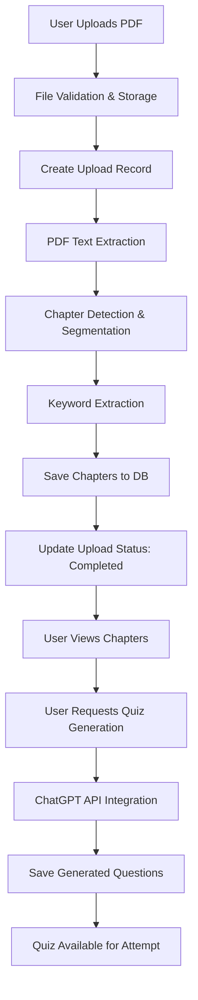

# Quiz Platform Architecture & Workflow Documentation

> **Project**: AI-Powered Quiz Generation Platform  
> **Version**: 1.0.0  
> **Last Updated**: June 2025  
> **Status**: Development Phase - Core Infrastructure Complete

## Tech Stack Overview

### Backend Framework
- **FastAPI** - Modern, fast web framework for building APIs
- **SQLAlchemy** - ORM for database operations
- **PostgreSQL** - Primary database
- **Alembic** - Database migrations

### PDF Processing
- **PyPDF2** - PDF text extraction
- **pdfplumber** - Alternative PDF processing (imported but not actively used)

### Authentication & Security
- **JWT (python-jose)** - Token-based authentication
- **bcrypt** - Password hashing
- **OAuth2PasswordBearer** - FastAPI security scheme

### Text Processing & ML
- **KeyBERT** - Keyword extraction using BERT embeddings
- **sentence-transformers** - For semantic text analysis
- **scikit-learn** - Machine learning utilities

## System Architecture Overview

### Processing Layers

```
┌─────────────────────────────────────────────────────────────┐
│                    PRESENTATION LAYER                        │
├─────────────────────────────────────────────────────────────┤
│  • FastAPI REST Endpoints                                   │
│  • WebSocket for Real-time Updates                          │
│  • JWT Authentication Middleware                            │
│  • CORS & Request Validation                                │
└─────────────────────────────────────────────────────────────┘
                                │
                                ▼
┌─────────────────────────────────────────────────────────────┐
│                    BUSINESS LOGIC LAYER                     │
├─────────────────────────────────────────────────────────────┤
│  • PDF Processing Pipeline                                  │
│  • Chapter Extraction Engine                                │
│  • AI Question Generation                                   │
│  • Keyword Analysis & Tagging                               │
│  • Quiz Attempt Tracking                                    │
└─────────────────────────────────────────────────────────────┘
                                │
                                ▼
┌─────────────────────────────────────────────────────────────┐
│                    DATA ACCESS LAYER                        │
├─────────────────────────────────────────────────────────────┤
│  • SQLAlchemy ORM Models                                    │
│  • Database Connection Pool                                 │
│  • Transaction Management                                   │
│  • Migration Scripts (Alembic)                              │
└─────────────────────────────────────────────────────────────┘
                                │
                                ▼
┌─────────────────────────────────────────────────────────────┐
│                    STORAGE LAYER                            │
├─────────────────────────────────────────────────────────────┤
│  • PostgreSQL Database                                      │
│  • File System (PDF Storage)                                │
│  • Configuration Management                                 │
└─────────────────────────────────────────────────────────────┘
```

## Current Architecture

### 1. Database Schema
```
Users
├── id, email, hashed_password
└── uploads (1:many)

Uploads
├── id, user_id, filename, file_path, title, description, status
├── uploaded_at, updated_at
└── chapters (1:many)

Chapters
├── id, upload_id, chapter_no, title, summary
├── content, keywords
├── tags (many:many through ChapterTag)
└── questions (1:many)

Tags
├── id, name, slug
└── chapters (many:many through ChapterTag)

Questions
├── id, chapter_id, q_text, options (JSON)
├── answer_key, explanation
└── attempts (1:many)

QuizAttempts
├── id, user_id, question_id, chosen_idx
├── is_correct, attempted_at
```

### 2. API Endpoints Structure
- `/api/auth` - Authentication (login, register)
- `/api/uploads` - File upload management
- `/api/chapters` - Chapter operations
- `/api/questions` - Question generation and retrieval
- `/api/history` - Quiz attempt history
- `/api/ws` - WebSocket for real-time updates

## Complete Processing Workflow

### End-to-End Data Flow



## PDF Processing Workflow

### Step 1: File Upload
1. User uploads PDF file via `/api/uploads`
2. File saved to local storage (`uploads/` directory)
3. Upload record created in database with status "processing"

### Step 2: PDF Text Extraction
1. **File Validation**: Check if PDF exists and is readable
2. **Page-by-Page Processing**: 
   - Extract text from each page using PyPDF2
   - Detect chapter boundaries (looks for "Chapter" or "CHAPTER" keywords)
   - Accumulate text for each detected chapter

### Step 3: Chapter Creation
1. **Chapter Detection Logic**:
   - Simple heuristic: new chapter when "Chapter" keyword found
   - Fallback: If no chapters detected, create single chapter with all content
2. **Chapter Data Structure**:
   - Chapter number, title, full content
   - Summary (first 500 characters)
   - Keywords extraction using custom algorithm

### Step 4: Keyword Extraction
**Current Implementation** (in `pdf.py`):
- Text cleaning and normalization
- Stop word filtering (comprehensive list)
- Word frequency analysis
- Returns top 15 keywords by frequency

**Alternative Implementation** (in `tagging.py`):
- Uses KeyBERT with "all-MiniLM-L6-v2" model
- BERT-based semantic keyword extraction
- More sophisticated but currently unused

### Step 5: Database Storage
1. Save all chapters to database
2. Update upload status to "completed"
3. Commit transaction or rollback on error

## AI-Powered Question Generation Workflow

### Enhanced Question Generation with ChatGPT Integration

### Question Generation Implementation Strategy

#### 1. Enhanced Question Generation Service

#### 2. Prompt Engineering Strategy

#### 3. Question Generation Workflow

### Advanced Features for Question Generation

#### 1. Content Analysis Before Generation
```python
def analyze_chapter_content(self, content: str) -> Dict:
    """Analyze chapter content to optimize question generation"""
    
    # Extract key concepts using KeyBERT
    keywords = self.keybert_model.extract_keywords(content, top_k=15)
    
    # Identify content type (technical, narrative, etc.)
    content_type = self._classify_content_type(content)
    
    # Estimate reading level
    reading_level = self._calculate_reading_level(content)
    
    return {
        "keywords": keywords,
        "content_type": content_type,
        "reading_level": reading_level,
        "word_count": len(content.split()),
        "key_topics": self._extract_topics(content)
    }
```

#### 2. Multi-Modal Question Types
```python
QUESTION_TEMPLATES = {
    "multiple_choice": {
        "system_prompt": "Create multiple choice questions with 4 options each...",
        "format": "Q: {question}\nA) {option1}\nB) {option2}\nC) {option3}\nD) {option4}"
    },
    "true_false": {
        "system_prompt": "Create true/false questions with detailed explanations...",
        "format": "Statement: {statement}\nTrue/False: {answer}"
    },
    "short_answer": {
        "system_prompt": "Create short answer questions requiring 2-3 sentence responses...",
        "format": "Question: {question}\nExpected Answer: {answer}"
    },
    "fill_in_blank": {
        "system_prompt": "Create fill-in-the-blank questions with key terms removed...",
        "format": "Complete: {sentence_with_blank}\nAnswer: {missing_term}"
    }
}
```

#### 3. Quality Assurance Pipeline
```python
class QuestionQualityChecker:
    def validate_question(self, question_data: Dict) -> bool:
        """Validate generated question quality"""
        
        checks = [
            self._check_question_clarity(question_data['question_text']),
            self._check_answer_validity(question_data['options'], question_data['correct_answer']),
            self._check_explanation_quality(question_data['explanation']),
            self._check_difficulty_appropriateness(question_data),
            self._check_content_relevance(question_data, self.source_content)
        ]
        
        return all(checks)
    
    def improve_question(self, question_data: Dict) -> Dict:
        """Use AI to improve question quality if validation fails"""
        improvement_prompt = f"""
        The following question needs improvement:
        {question_data}
        
        Please revise to:
        - Make the question clearer
        - Ensure only one correct answer
        - Improve the explanation
        - Match the requested difficulty level
        """
        # Make another API call for improvement
        return self._call_improvement_api(improvement_prompt)
```

## Error Handling & Logging

### Comprehensive Error Management
- File not found errors
- PDF parsing errors  
- Database transaction errors
- Page processing errors

### Logging Strategy
- Structured logging with timestamps
- Different log levels (INFO, ERROR, WARNING)
- Detailed error tracking with stack traces
- Status updates throughout processing pipeline

## Security Features

### Authentication Flow
1. User registration/login via `/api/auth`
2. JWT token generation with configurable expiration
3. Protected routes using OAuth2PasswordBearer
4. User session management

### Data Protection
- Password hashing with bcrypt
- JWT token validation on protected endpoints
- User isolation (users only see their own uploads)

## Configuration Management

### Environment-Based Settings
- Database connection strings
- JWT secret keys
- File upload directories
- Token expiration times

## Current Limitations & Enhancement Opportunities

### 1. Question Generation
- **Current**: Static placeholder questions
- **Opportunity**: Implement LLM-based question generation using transformers

### 2. Chapter Detection
- **Current**: Simple keyword-based detection
- **Opportunity**: Use ML models for better document structure analysis

### 3. Content Analysis
- **Current**: Basic keyword extraction
- **Opportunity**: Leverage KeyBERT and sentence-transformers for deeper analysis

### 4. Quiz Intelligence
- **Current**: Basic question storage
- **Opportunity**: Adaptive questioning, difficulty levels, personalized quizzes

## Recommended Next Steps

### Phase 1: AI Question Generation (Priority)
1. **Integrate OpenAI API**
   ```bash
   pip install openai
   ```
   - Add OpenAI API key to configuration
   - Implement AIQuestionGenerator service
   - Create comprehensive prompt templates

2. **Enhanced Question Models**
   - Add difficulty_level, question_type fields to Question model
   - Create QuestionGenerationRequest schema
   - Implement validation logic

3. **User Interface Enhancements**
   - Question generation form with custom prompts
   - Real-time generation progress indicators
   - Question preview and editing capabilities

### Phase 2: Advanced Features
1. **Content Analysis Pipeline**
   - Implement KeyBERT integration for better keyword extraction
   - Add content type classification
   - Reading level assessment

2. **Question Quality Assurance**
   - Automated question validation
   - Question improvement iterations
   - User feedback integration

3. **Performance Optimization**
   - Async question generation
   - Batch processing for multiple chapters
   - Caching frequently used prompts

### Phase 3: Intelligence Layer
1. **Adaptive Question Generation**
   - User performance-based difficulty adjustment
   - Learning path recommendations
   - Personalized question types

2. **Analytics & Insights**
   - Question effectiveness metrics
   - User learning progress tracking
   - Content difficulty analysis

### Implementation Priority Matrix

| Feature | Impact | Effort | Priority |
|---------|--------|--------|----------|
| ChatGPT Integration | High | Medium | 🔥 Immediate |
| Custom User Prompts | High | Low | 🔥 Immediate |
| Question Validation | Medium | Medium | ⚡ Next Sprint |
| Batch Generation | Medium | Low | ⚡ Next Sprint |
| Analytics Dashboard | High | High | 📅 Future |
| Adaptive Algorithms | High | High | 📅 Future |

Your architecture is well-designed and ready for these enhancements!

---

## Development Status & Metrics

### Completed Features ✅
- [x] User authentication & authorization system
- [x] PDF file upload & processing pipeline
- [x] Chapter extraction & text analysis
- [x] Database schema & relationships
- [x] RESTful API endpoints
- [x] Error handling & logging system
- [x] Keyword extraction algorithms

### In Progress 🔄
- [ ] LLM-based question generation
- [ ] Real-time processing updates via WebSocket
- [ ] Advanced chapter detection using ML

### Planned Features 📋
- [ ] Quiz attempt tracking & analytics
- [ ] Adaptive questioning algorithms
- [ ] Performance dashboards
- [ ] Multi-format document support

---

## File Structure Overview

```
app/
├── core/
│   ├── config.py          # Application settings
│   ├── db.py             # Database connection
│   └── deps.py           # FastAPI dependencies
├── models.py             # SQLAlchemy ORM models
├── services/
│   ├── pdf.py            # PDF processing pipeline
│   ├── quiz.py           # Question generation
│   ├── tagging.py        # KeyBERT keyword extraction
│   └── extractor.py      # Text extraction utilities
├── api/                  # FastAPI route handlers
│   ├── auth.py
│   ├── uploads.py
│   ├── chapters.py
│   ├── questions.py
│   ├── history.py
│   └── ws.py
└── main.py              # FastAPI application entry point
```

---

## Deployment Considerations

### Environment Variables
```bash
# Database Configuration
POSTGRES_USER=your_db_user
POSTGRES_PASSWORD=your_db_password
POSTGRES_SERVER=localhost
POSTGRES_PORT=5432
POSTGRES_DB=quiz_platform

# Security
SECRET_KEY=your-super-secret-jwt-key
ACCESS_TOKEN_EXPIRE_MINUTES=30

# File Storage
UPLOAD_DIR=uploads
```

### System Requirements
- Python 3.8+
- PostgreSQL 12+
- 2GB+ RAM for ML models
- 10GB+ storage for uploads

---

## API Documentation

### Authentication Endpoints
- `POST /api/auth/register` - User registration
- `POST /api/auth/login` - User login (returns JWT)

### Upload Management
- `POST /api/uploads` - Upload PDF file
- `GET /api/uploads` - List user uploads
- `GET /api/uploads/{id}` - Get upload details

### Chapter Operations
- `GET /api/chapters/{upload_id}` - Get chapters for upload
- `GET /api/chapters/{id}` - Get specific chapter

### Question Management
- `POST /api/questions/generate/{chapter_id}` - Generate questions
- `GET /api/questions/{chapter_id}` - Get chapter questions

---

**End of Documentation**